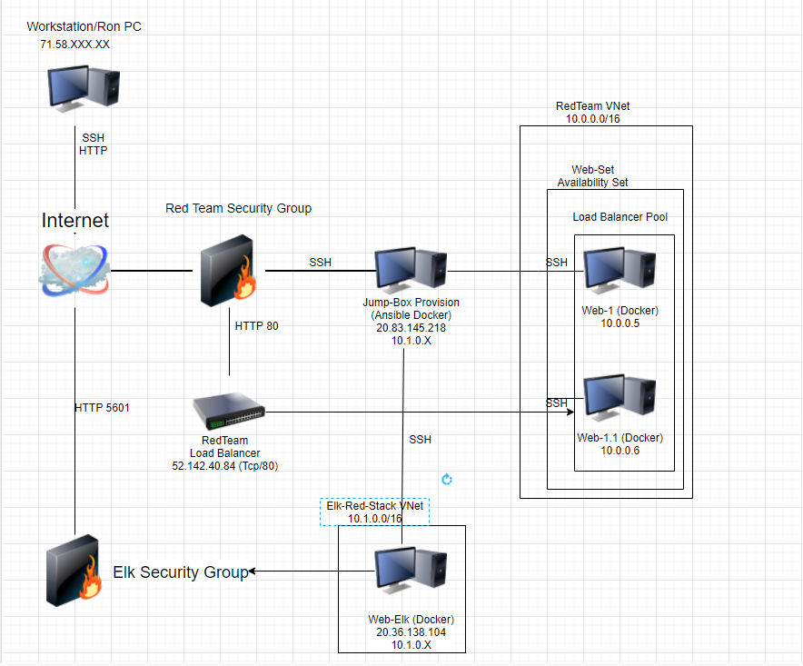
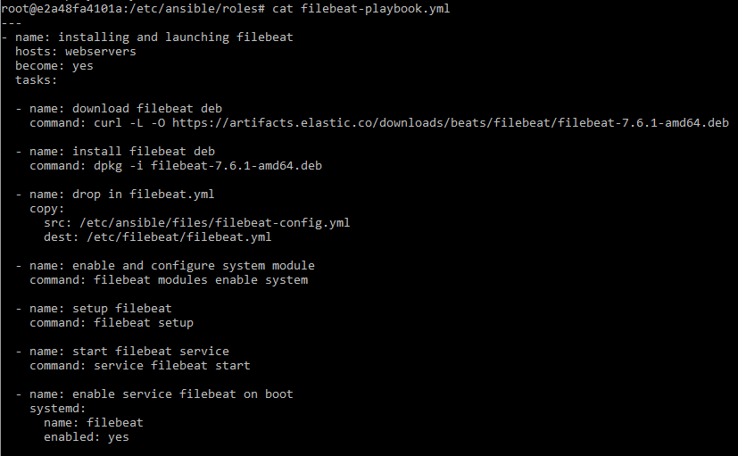
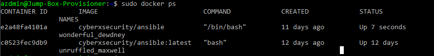

# Elk_Stack
## Automated ELK Stack Deployment

The files in this repository were used to configure the network depicted below.

These files have been tested and used to generate a live ELK deployment on Azure. They can be used to either recreate the entire deployment pictured above. Alternatively, select portions of the playbook file may be used to install only certain pieces of it, such as Filebeat.

 

This document contains the following details:
- Description of the Topologu
- Access Policies
- ELK Configuration
  - Beats in Use
  - Machines Being Monitored
- How to Use the Ansible Build

### Description of the Topology

The main purpose of this network is to expose a load-balanced and monitored instance of DVWA, the D*mn Vulnerable Web Application.

Load balancing ensures that the application will be highly available, in addition to restricting traffic to the network.

What aspect of security do load balancers protect? A  load balancer protects the system against DDoS(Distributed Denial of Service) attacks by shifting attack traffic.
 
What is the advantage of a jump box? A jump box controls access to other machines by allowing connections from specific IP addresses, then forwarding those connections to their respective machines.

Integrating an ELK server allows users to easily monitor the vulnerable VMs for changes to the logs and system traffic.

What does Filebeat watch for? Filebeat watches and collects data about the file system.
What does Metricbeat record? Metricbeat records and collects operating machines metrics.

The configuration details of each machine may be found below.

| Name                 | Function     | IP Address    | Operating System |
|----------------------|--------------|---------------|------------------|
| Jump-Box-Provisioner | Gateway      | 20.83.145.218 | Linux            |
| Web-1                | UbuntuServer | 10.0.0.5      | Linux            |
| Web-1.1              | UbuntuServer | 10.0.0.6      | Linux            |
| Web-Elk              | UbuntuServer | 10.1.0.4      | Linux            |
| redteam_LoadBalancer | LoadBalancer | 52.142.40.84  |                  |

### Access Policies

The machines on the internal network are not exposed to the public Internet. 

Only the Jump Box machine can accept connections from the Internet. Access to this machine is only allowed from the following IP addresses:

71.58.XXX.XX

Machines within the network can only be accessed by SSH.

Which machine did you allow to access your ELK VM? Jump-Box-Provisioner
What was its IP address? 20.83.145.218

A summary of the access policies in place can be found in the table below.

| Name                 | Publicly Accessable | Allowed IP Addresses |
|----------------------|---------------------|----------------------|
| Jump-Box-Provisioner | Yes                 | 20.83.145.218        |
| Web-1                | No                  | 10.0.0.4             |
| Web-1.1              | No                  | 10.0.0.4             |
| Web-Elk              | No                  | 10.0.0.4             |

### Elk Configuration

Ansible was used to automate configuration of the ELK machine. No configuration was performed manually. 

What is the main advantage of automating configuration with Ansible? 
Advantage of automating configuration with Ansible is that you can put commands into multiple servers from a single playbook.

The playbook implements the following tasks:
- Install: docker.io
- Install: python-pip
- Install: docker
- Increase virtual memory
- Download and lauch a docker container through published ports:
  -   5601:5601
  -   9200:9200
  -   5044:5044

The following screenshot displays the result of running `docker ps` after successfully configuring the ELK instance.

### Target Machines & Beats
This ELK server is configured to monitor the following machines:
- Web-1 - 10.0.0.5
- Web-1.1 - 10.0.0.6

We have installed the following Beats on these machines:
- filebeat

These Beats allow us to collect the following information from each machine:
- Filebeat - collects data about the file system such as log events, and ships them to the monitoring cluster.

### Using the Playbook
In order to use the playbook, you will need to have an Ansible control node already configured. Assuming you have such a control node provisioned: 

SSH into the control node and follow the steps below:
- Copy the Playbook file to Ansible.
- Update the host file to include webserver and Elk
- Run the playbook, and navigate to Kibana to check that the installation worked as expected.

- Which file is the playbook? Where do you copy it? We have filebeat and metricbeat playbooks which are copied in the abisble container.

- Which file do you update to make Ansible run the playbook on a specific machine? How do I specify which machine to install the ELK server on versus which to install Filebeat on? Simply by adding the ELK's IP to the ansible.cfg file and then save your progress for changes to take effect.
- Which URL do you navigate to in order to check that the ELK server is running? 
- http://20.36.138.104:5601/app/kibana

_As a **Bonus**, provide the specific commands the user will need to run to download the playbook, update the files, etc._
